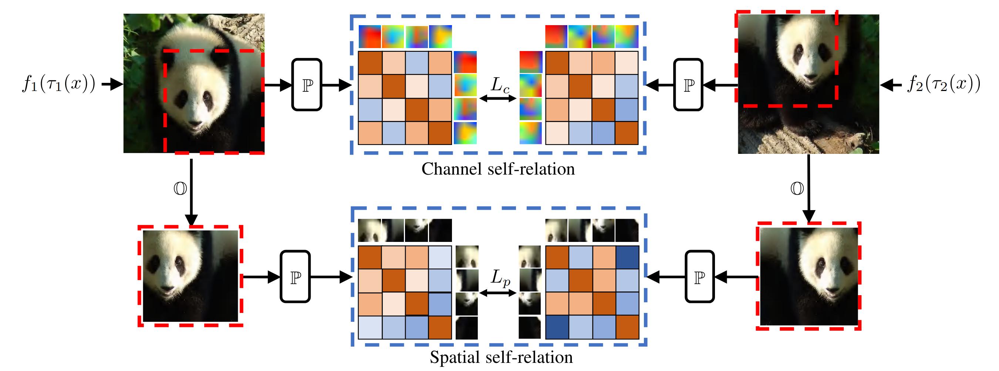

# SERE: Exploring Feature Self-relation for Self-supervised Transformer ([TPAMI 2023](https://ieeexplore.ieee.org/document/10234504))

The official codebase for [SERE: Exploring Feature Self-relation for Self-supervised Transformer](https://arxiv.org/abs/2206.05184).

## Introduction

<div align="center">
  
</div>

Learning representations with self-supervision for convolutional networks (CNN) has been validated to be effective for vision tasks. As an alternative to CNN, vision transformers (ViT) have strong representation ability with spatial self-attention and channel-level feedforward networks. Recent works reveal that self-supervised learning helps unleash the great potential of ViT. Still, most works follow self-supervised strategies designed for CNN, e.g., instance-level discrimination of samples, but they ignore the properties of ViT. We observe that relational modeling on spatial and channel dimensions distinguishes ViT from other networks. To enforce this property, we explore the feature SElf-RElation (SERE) for training self-supervised ViT. Specifically, instead of conducting self-supervised learning solely on feature embeddings from multiple views, we utilize the feature self-relations, i.e., spatial/channel self-relations, for self-supervised learning. Self-relation based learning further enhances the relation modeling ability of ViT, resulting in stronger representations that stably improve performance on multiple downstream tasks. 

## Installation
Please install [PyTorch](https://pytorch.org/) and download the [ImageNet](https://imagenet.stanford.edu/) dataset. 
This codebase has been developed with python version 3.8, PyTorch version 1.10.1, CUDA 11.3 and torchvision 0.11.2. 

## Training and Pre-trained Models

<table>
  <tr>
    <th>Architecture</th>
    <th>Method</th>
    <th>Parameters</th>
    <th>Pre-training Epochs</th>
    <th>Fine-tuning Epochs</th>
    <th>Top-1</th>
    <th colspan="6">download</th>
  </tr>
  <tr>
    <td>ViT-S/16</td>
    <td>iBOT+SERE</td>
    <td>21M</td>
    <td>100</td>
    <td>100</td>
    <td>81.5%</td>
    <td><a href="https://drive.google.com/file/d/1pu7ASX7DKY3rB2HhJnDEOQpB7k6sAIMH/view?usp=sharing">backbone</a></td>
  </tr>
  <tr>
    <td>ViT-B/16</td>
    <td>iBOT+SERE</td>
    <td>85M</td>
    <td>100</td>
    <td>100</td>
    <td>83.7%</td>
    <td><a href="https://drive.google.com/file/d/1B3GBxlXq12r_E3ZWi8VvI2efwFYpNBev/view?usp=sharing">backbone</a></td>
  </tr>
</table>

<details>
  <summary>IBOT+SERE with ViT-S/16:</summary>

```shell
python -m torch.distributed.launch --nproc_per_node=8 \
--master_port=$PORT \
main_sere.py \
--arch vit_small \
--output_dir $OUTPUT_DIR \
--data_path $IMAGENET \
--teacher_temp 0.07 \
--warmup_teacher_temp_epochs 30 \
--norm_last_layer false \
--epochs 100 \
--shared_head true \
--out_dim 8192 \
--local_crops_number 10 \
--global_crops_scale 0.40 1 \
--local_crops_scale 0.05 0.40 \
--pred_ratio 0 0.3 \
--pred_ratio_var 0 0.2 \
--batch_size_per_gpu 128 \
--num_workers 6 \
--saveckp_freq 10 \
--alpha 0.2 \
--beta 0.5 \
--clip_grad 0.3
```

</details>

<details>
  <summary>IBOT+SERE with ViT-B/16:</summary>

```shell
python -m torch.distributed.launch --nproc_per_node=8 \
--master_port=$PORT \
main_sere.py \
--arch vit_base \
--output_dir $OUTPUT_DIR \
--data_path $IMAGENET \
--teacher_temp 0.07 \
--teacher_patch_temp 0.07 \
--warmup_teacher_temp 0.04 \
--warmup_teacher_patch_temp 0.04 \
--warmup_teacher_temp_epochs 50 \
--norm_last_layer true \
--warmup_epochs 10 \
--epochs 100 \
--lr 0.00075 \
--min_lr 2e-6 \
--weight_decay 0.04 \
--weight_decay_end 0.4 \
--shared_head true \
--shared_head_teacher true \
--out_dim 8192 \
--patch_out_dim 8192 \
--local_crops_number 10 \
--global_crops_scale 0.32 1 \
--local_crops_scale 0.05 0.32 \
--pred_ratio 0 0.3 \
--pred_ratio_var 0 0.2 \
--pred_shape block \
--batch_size_per_gpu 128 \
--num_workers 6 \
--saveckp_freq 10 \
--freeze_last_layer 3 \
--clip_grad 0.3 \
--alpha 0.2 \
--beta 0.5 \
--use_fp16 true
```

</details>


## Evaluation

We fully fine-tune the pre-trained models on ImageNet-1K 
by using the codebase of [MAE](https://github.com/facebookresearch/mae). 

For downstream tasks, 
e.g., semantic segmentation, 
PLease refer to [iBOT](https://github.com/bytedance/ibot). 

Addentionally, we also use [ImageNetSegModel](https://github.com/LUSSeg/ImageNetSegModel/tree/main) 
to implement semi-supevised semantic segmentation on [ImageNet-S dataset](https://github.com/LUSSeg/ImageNet-S).

## Citing SERE
If you find this repository useful, please consider giving a star and a citation:
```
@article{li2023sere,
  title={SERE: Exploring Feature Self-relation for Self-supervised Transformer},
  author={Zhong-Yu Li and Shanghua Gao and Ming-Ming Cheng},
  journal=TPAMI,
  year={2023}
}
```


## License
The code is released under the [Creative Commons Attribution-NonCommercial-ShareAlike 4.0 International Public License](https://creativecommons.org/licenses/by-nc-sa/4.0/legalcode) for Noncommercial use only. Any commercial use should get formal permission first.

## Acknowledgement

This repository is built using the [DINO](https://github.com/facebookresearch/dino) repository, the [iBOT](https://github.com/bytedance/ibot) repository, 
and the [MAE](https://github.com/facebookresearch/mae) repository.
